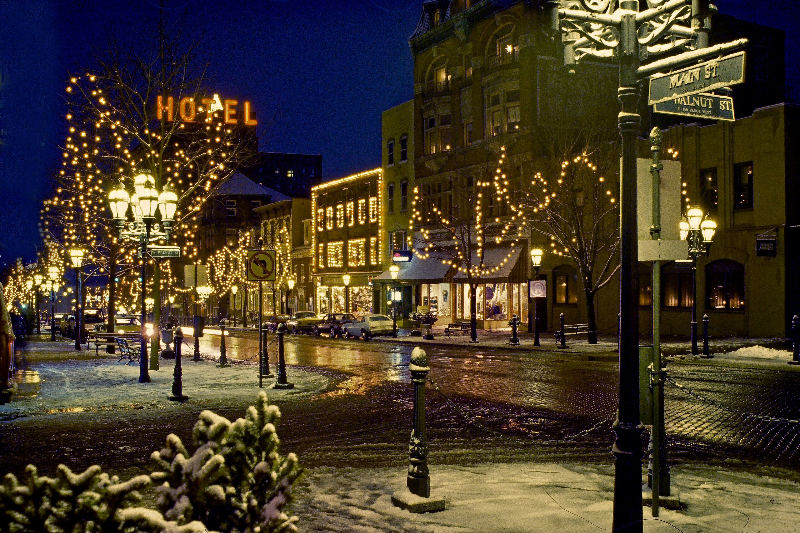
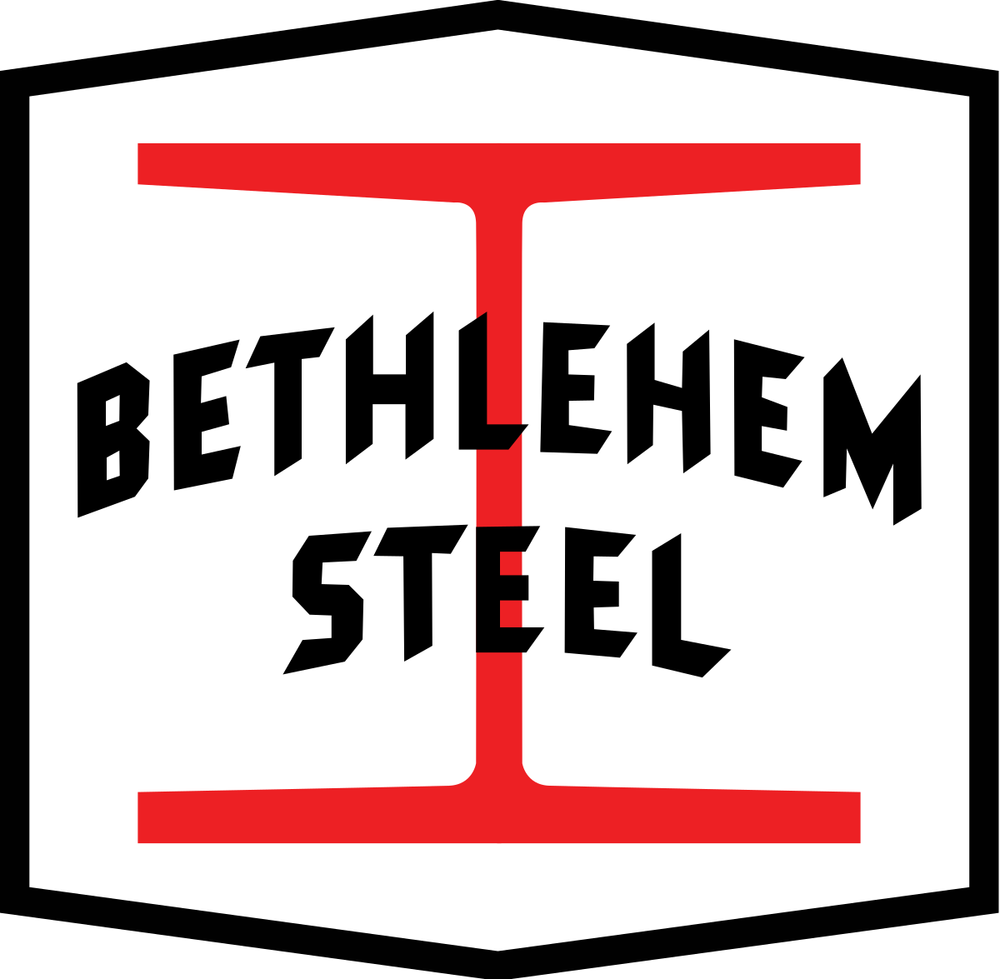
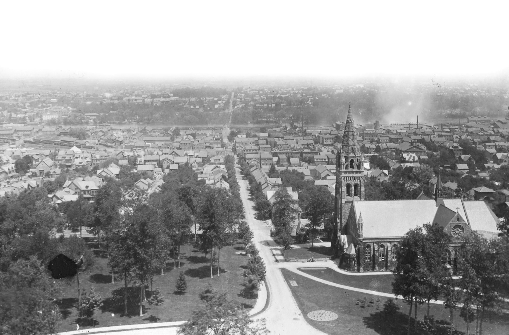
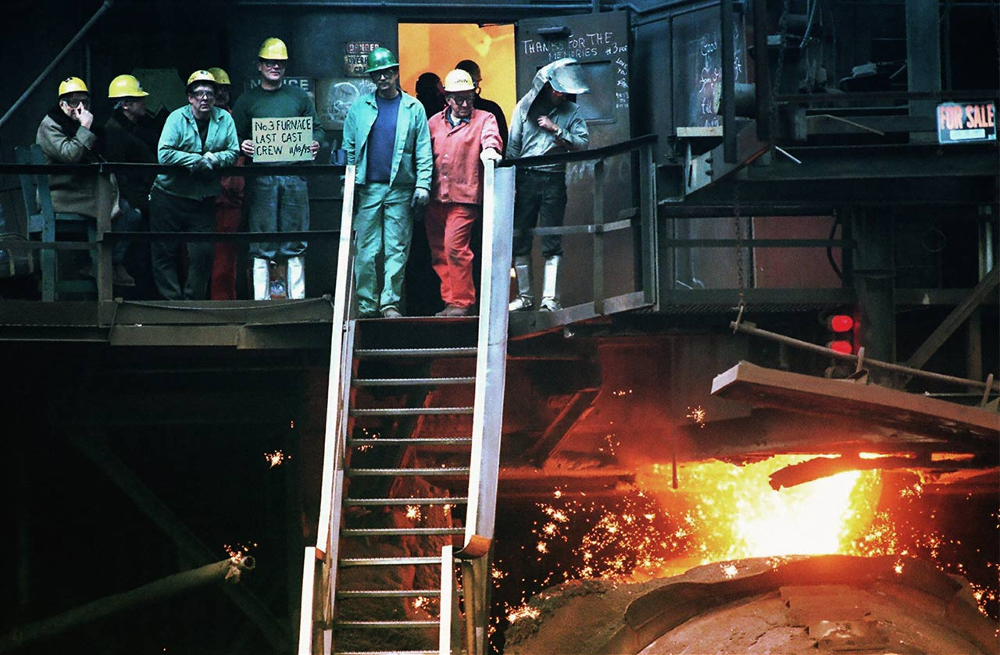
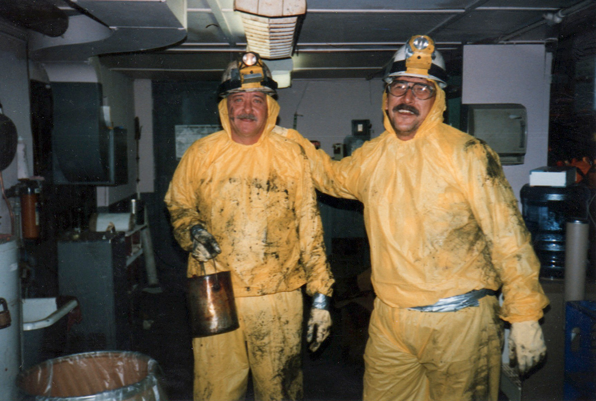

> ベスレヘム —
> キリスト生誕地として知られるこの名前を持つ街が、アメリカ・ペンシルベニア州にも存在する。激動の時代、アメリカを支え、鋼と共にその名を刻んだのは、まさにこの街だった。今回は、私が大学時代を過ごした、この街の歴史を紐解く。

### 「クリスマス・シティ」

1741年のクリスマス・イヴ、モラヴィアン兄弟団によって設立されたベスレヘムは、「クリスマス・シティ」の愛称で親しまれている。同教会は、15世紀にボヘミア（現・チェコ）で始まった宗教改革運動を基盤とし、福音宣教と共同体生活を重視していた。当時のヨーロッパでの宗教的迫害を逃れ、宗教的自由を求めた彼らは、この地にたどり着いたのである。

初期のベスレヘムは、共同生活、相互扶助、そして厳格な規律に基づく宗教都市として発展した。今日でも、歴史地区にはGemeinhaus（共同住宅）が点在し、当時の面影が窺える。また、地元のネイティブ・アメリカンとも友好的な関係を築き、彼らのための伝道所も設立されていた。

同教会は教育に熱心で、翌年にはアメリカ最古のプロテスタント系女子寄宿学校である、ベスレヘム女子神学校（現・モラヴィアン大学）が設立された。

### 「アメリカを築いた街」

19世紀、アメリカは第二次産業革命に突入、激動の時代を迎える。新たな「アメリカの工場」として白羽の矢が立ったのはベスレヘムであった。天然資源に恵まれ、リーハイ川とデラウェア川に囲まれ、さらにニューヨークとフィラデルフィアの中間に位置するベスレヘムには、工業発展においてこれ以上ない好条件が揃っていた。

1857年に設立されたベスレヘム・アイアン・カンパニーは、南北戦争による特需の波に乗り急成長する。主に鉄道の軌道や弾丸の製造を行っていたものの、やがて軍需産業に進出し、戦車・装甲車などの生産も行うようになる。第一・二次世界大戦中には栄華を極め、USスチールに次ぐ全米第二の製鉄会社として、ベスレヘムの名を世界に轟かせた。

1899年、ベスレヘム・アイアン・カンパニーは再編され、ベスレヘム・スチール・コーポレーションが設立。前述の地の利に加え技術者にも恵まれ、画期的な技術を次々と開発する。特筆すべきは、H型鋼（Iビーム）であろう。高層建築を可能にしたこの発明は、エンパイア・ステート・ビル（1931年）やゴールデン・ゲート・ブリッジ（1937年）、アイオワ級戦艦・ミズーリ（1944）に使用され、ベスレヘムはまさに、「アメリカを築いた街」となった。

### 教育都市として

前述のベスレヘム女子神学校は1954年にモラビアン大学・神学校と統合され、共学化した。これにより、モラビアン大学は全米で7番目に長い歴史を持つ大学となった。

1865年、鉄鋼業の実業家であり下院議員でもあったアサ・パッカーにより、リーハイ大学が設立された。私のアルマ・マータである。鉄鋼実業家が設立者である背景から、同大学の工学部は特に強力であり、工学部棟やメインキャンパスには「アサ・パッカー」の名が冠されている。

### 斜陽

1970年代以降、日本をはじめとするアジア諸国からの高品質かつ低価格な鉄鋼の競争に押され、ベスレヘム・スチールの業績は急速に悪化していった。追い討ちをかけるように、プラスチックやアルミニウムなどの新素材の台頭により鉄の需要が低下、そして度重なる大規模事故が決定打となり、同社は2001年に倒産。144年の歴史に幕を閉じた。

背後の落書きに注目されたい。

> THANKS FOR THE MEMORIES
>
> （思い出をありがとう）

無骨な字に、静かな誇りを感じるのは私だけだろうか。ベスレヘムを支えた男たちの生き様が、ここに息づいている。

